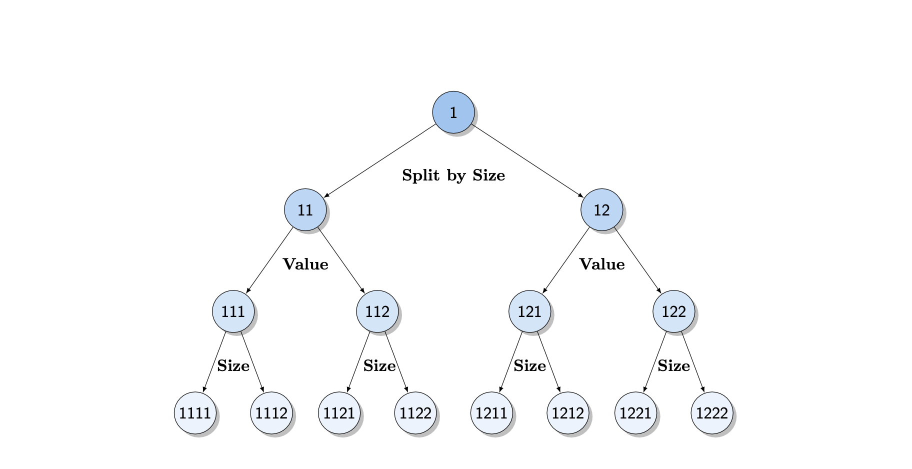
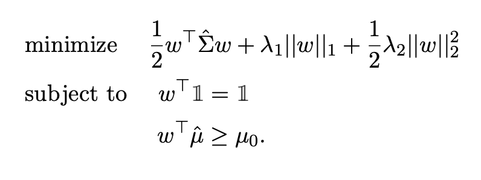
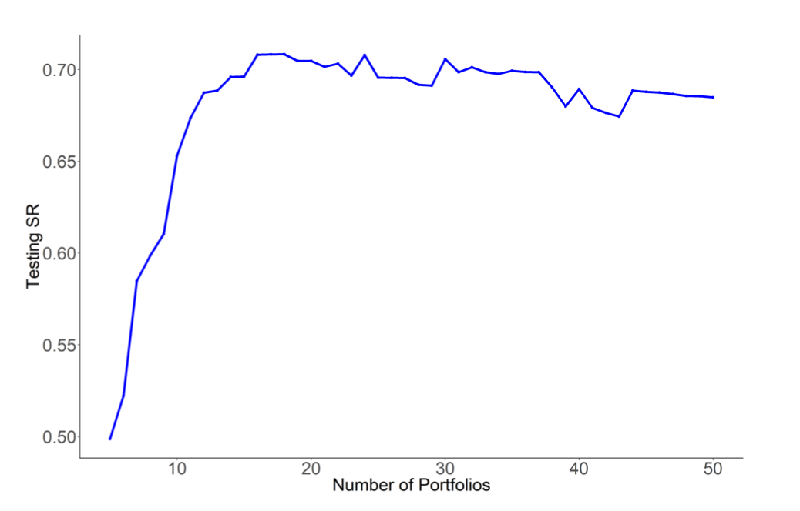
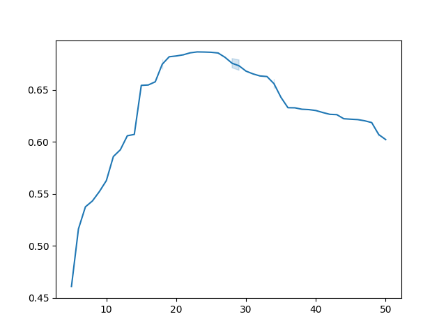

# Forest through the Trees
## Introduction
This repository contains the implementation of the paper 
[Forest through the Trees: Building Cross-Sections of Stock Returns](https://papers.ssrn.com/sol3/papers.cfm?abstract_id=3493458).

The project is largely based on the official R prototype, available on [the official webpage](https://mpelger.people.stanford.edu/data-and-code).

### Method Overview

#### Asset Pricing trees 
Based on the set of stock characteristics, cross-sections of asset returns could be 
build using the *Asset-Pricing tree* algorithm:
1. The firms are categorized into two (**n_splits** parameter) equally sized groups according to the high/low value of a characteristic variable (For example, *Size*)
2. Within each group, stocks are further splitted into two equally sized subgroups by another characteristic (For example, *value*).
3. Step 2 repeats until the algorithm reaches the maximum **tree_depth** value.

In total, with **tree depth** of 4 and **n_splits** of 2, there are 2^4 = 16 different subgroups built at the end of the tree.  

An example of AP-tree provided in the paper:


#### Tree Pruning with ElasticNet ML model
While the set of basis assets built by AP-tree does reflect the relevant information conditional on stock characteristics, 
one could face the **curse of dimensionaly** problem: 

* With only 2 characteristics,the number of basis functions will be equal to 64. (given **n_splits**  and **tree_depth** equal to 2 and 3, respectively)

Thus, the researchers proposed a technique that not only lowers the dimension of the basis assets, 
but also retain both the relevant information from the characteristics and portfolio interpretability.

In particular, the model solves *mean-variance portfolio construction problem* with elastic net:


The hyperparameters (mean shrinkage, L1 and L2 regularization lambdas) are tuned on the validation set 
using Time-Series cross-validation technique, and the model is finally evaluated on the test set.
#### Comparison
The comparison between implementations is made based on out-of-sample Sharpe ratio as a function of tuning parameters 
for AP-Trees on Size, Investment and Operating Profitability.
In the paper, the lineplot looks as follows:


In this implementation, the lineplot looks as follows:


## Setup
Dependencies for Python 3.7:
- Numpy 1.21.1 
- PyTorch 1.9.0

Install the required packages
```
pip install -r requirements.txt
```
## Usage
Download the required dataset from the [link](https://www.dropbox.com/sh/gukpci07xpdjl6i/AAA1_EyOxYZy7rr1BAUGFloEa?dl=0).

Place all the files from the directory into *characteristics* folder.

To build tree portfolios, run the command:
```
python build_trees.py
```

To prune the resulted trees, run the command:
```
python prune_trees.py
```

To plot test SR, run the command:
```
python plot_test_sr.py --feature_combination {e.g. lme_op_investment}
```


